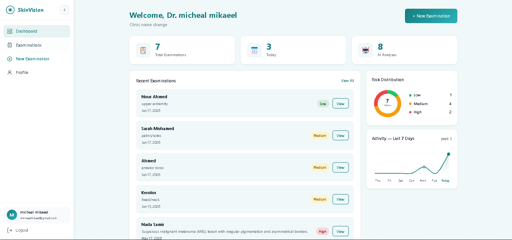
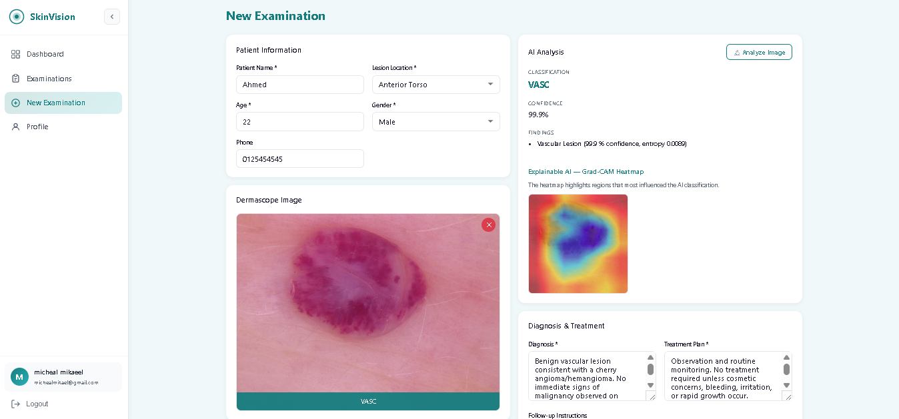
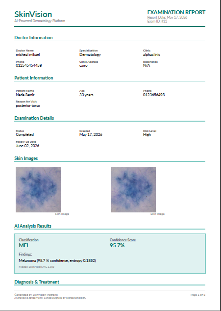
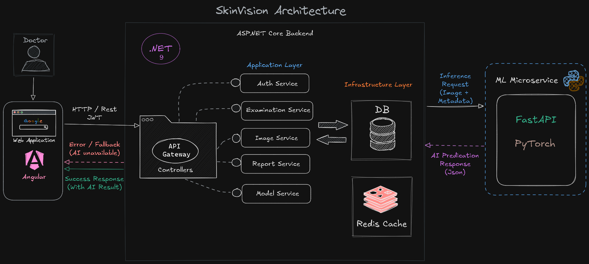

<p align="center">
  
</p>


<p align="center">
  <strong>
    AI-powered dermatology platform for lesion classification,
    examination management, and professional medical reporting.
  </strong>
</p>

<p align="center">
  <a href="#demo">Demo</a> ·
  <a href="#highlights">Highlights</a> ·
  <a href="#architecture">Architecture</a> ·
  <a href="#getting-started">Getting Started</a> ·
  <a href="#api-reference">API</a>
</p>

<p align="center">
  
  
  
  
  
  
</p>

---

# Why SkinVision?

SkinVision was built to simulate the engineering challenges of a real-world AI-powered medical platform.

Instead of focusing only on machine learning accuracy, the project emphasizes:

- scalable backend architecture
- fault-tolerant AI integration
- secure doctor-scoped workflows
- auditability of medical records
- production-oriented infrastructure patterns
- separation between clinical workflows and AI inference

The goal is to demonstrate how modern healthcare AI systems can be engineered responsibly — where AI assists clinicians without becoming a system dependency.

---
<h2> Dashboard </h2>

<p align="center">
  
</p>


<summary>More screenshots</summary>
<br>

| Dashboard | AI Analysis | Generated Report |
|:---:|:---:|:---:|
|  |  |  |


---

# What It Does

SkinVision helps doctors:

- manage patient examinations
- upload dermoscopy images
- receive AI-assisted lesion classifications
- record diagnoses
- generate downloadable PDF reports

The platform is designed around real-world backend engineering concerns including:
- secure doctor-scoped access
- image-heavy workflows
- AI fault tolerance
- scalable storage
- auditability of medical records

> AI predictions are advisory only and never replace clinical judgment.

---

# AI Model

SkinVision uses a **v2.0.0 multi-model ensemble** trained on the ISIC 2019 dataset (~25k dermoscopy images across 9 diagnostic classes).

The ensemble combines:
- **HRNet-W32** backbone with metadata cross-attention fusion (age, sex, anatomical site)
- **Swin-V2-T** backbone with metadata cross-attention fusion (age, sex, anatomical site)
- **XGBoost meta-classifier** stacking both CNN probability outputs as input features

### Preprocessing Pipeline

1. **Dullrazor hair removal** — morphological black-hat filtering + inpainting removes dark hair artefacts from dermoscopic images before classification.
2. **Image normalization** — resize to 224×224, normalize with ImageNet statistics.

### Metadata Cross-Attention Fusion

Patient metadata (age, sex, anatomical site) is projected into the same embedding dimension as CNN features, then **cross-attention** is applied with metadata as query and image features as key/value. The fused representation is passed through dropout (p=0.4) and a linear classifier.

### Ensemble Stacking

HRNet and Swin each produce 9-class probability vectors. These 18 probabilities are concatenated into a meta-feature vector, which the **XGBoost meta-classifier** uses to produce final predictions.

### Explainability

- **Grad-CAM heatmaps** are always generated on the HRNet model for every prediction, providing class-discriminative visual explanations stored as base64-encoded PNGs.
- **Prediction entropy** — Shannon entropy of the class probability distribution quantifies prediction uncertainty (~0 = very confident, ~2.2 ≈ uniform over 9 classes).

### Model Weight Files

| File | Model |
|------|-------|
| `03_HRNet_Dullrazor.pth` | HRNet-W32 fine-tuned checkpoint |
| `04_Swin_Dullrazor.pth` | Swin-V2-T fine-tuned checkpoint |
| `05_XGBoost_Meta_Classifier.joblib` | XGBoost stacked meta-classifier |

## Supported classifications

| Code | Condition |
|------|-----------|
| MEL | Melanoma |
| NV | Melanocytic Nevus |
| BCC | Basal Cell Carcinoma |
| AK | Actinic Keratosis |
| BKL | Benign Keratosis |
| DF | Dermatofibroma |
| VASC | Vascular Lesion |
| SCC | Squamous Cell Carcinoma |
| UNK | Unknown / Unclassifiable |

---

# Architecture

The backend follows **Clean Architecture** — dependencies point inward, and no layer references the one above it.

| Layer | Project | Responsibility |
|-------|---------|---------------|
| API | `SkinVision.API` | Controllers, middleware, DI, CORS, Swagger |
| Application | `SkinVision.Application` | Services, DTOs, interfaces, business rules |
| Domain | `SkinVision.Domain` | Entities, enums, domain invariants |
| Infrastructure | `SkinVision.Infrastructure` | EF Core context, repositories, storage, PDF generation |

---

## System Architecture Diagram

<p align="center">
  
</p>

---

# Engineering Decisions

## Independent ML Microservice

AI inference runs inside a separate FastAPI/PyTorch service instead of the main .NET process. This keeps the API lightweight, allows independent scaling/versioning, and isolates ML failures from core examination workflows.

## Storage Abstraction

Uploads are handled through an `IFileStorageService` abstraction. Local storage is used during development while the production design targets Azure Blob Storage without changing application logic.

## Fault-Tolerant AI Workflow

Examinations and uploads succeed even if ML inference fails. AI predictions are treated as optional workflow enhancements rather than critical dependencies. Images can be uploaded without prediction (`/upload`) and analyzed later (`/analyze`).

## Traceable Medical Records

Predictions, images, reports, and examinations are stored independently to preserve auditability and historical traceability. Heatmaps are persisted to disk and referenced by path for long-term retrieval.

## Performance-Oriented Pipeline

The platform uses:
- async request handling
- SQL-level filtering
- optimized tensor preprocessing
- lightweight inference execution
- scalable storage abstractions

---

# Features

## Backend

- Clean Architecture backend
- RESTful ASP.NET Core API
- Structured logging with Serilog
- Repository and service abstraction patterns
- Async request pipeline

## AI

- Multi-model ensemble lesion classification (HRNet + Swin + XGBoost)
- Dullrazor hair-removal preprocessing pipeline
- Metadata-enhanced cross-attention fusion (age, sex, anatomical site)
- Grad-CAM explainability heatmaps (always generated)
- Prediction entropy for uncertainty quantification
- Independent ML microservice (FastAPI)

## Security

- JWT authentication
- BCrypt password hashing
- Secure doctor-scoped access control
- Google OAuth2 sign-in
- External login linking and account management

## Frontend

- Angular 21 dashboard
- Responsive Tailwind UI
- Route guards and JWT interceptors
- Server-side filtering and search
- Admin panel for user management and audit logs

---

# Tech Stack

| Layer | Technology |
|-------|-----------|
| Backend API | .NET 9, ASP.NET Core, EF Core, Serilog |
| Frontend | Angular 21, TypeScript, Tailwind CSS |
| ML Service | Python 3.11, FastAPI, PyTorch, XGBoost, scikit-learn |
| Database | SQL Server |
| Authentication | JWT Bearer Tokens, BCrypt, Google OAuth2 |
| PDF Generation | QuestPDF |
| Testing | xUnit, Vitest |

---

# Project Structure

```text
SkinVision/
├── SkinVision.API/              # ASP.NET Core Web API
│   ├── Controllers/
│   │   ├── AuthController.cs
│   │   ├── ExaminationsController.cs
│   │   ├── ReportsController.cs
│   │   ├── OAuthController.cs
│   │   ├── ProfileController.cs
│   │   └── AdminController.cs
│   ├── Extensions/
│   └── Properties/
├── SkinVision.Application/      # Business logic layer
│   ├── DTOs/
│   │   ├── AuthDtos.cs
│   │   ├── ExaminationDTOs.cs
│   │   ├── ImageDtos.cs
│   │   ├── ReportDTOs.cs
│   │   ├── UserDtos.cs
│   │   ├── ChangePasswordDto.cs
│   │   └── AdminDtos.cs
│   ├── Interfaces/
│   │   ├── Repositories/
│   │   └── Services/
│   │       ├── IDlPredictionService.cs
│   │       ├── IAuthService.cs
│   │       ├── IOAuthService.cs
│   │       ├── IExaminationService.cs
│   │       ├── IAdminService.cs
│   │       └── ...
│   └── Services/
│       ├── DlPredictionService.cs
│       ├── AuthService.cs
│       ├── GoogleOAuthService.cs
│       ├── ExaminationService.cs
│       ├── AdminService.cs
│       └── ...
├── SkinVision.Domain/           # Core domain
│   ├── Entities/
│   │   ├── Examination.cs        # AnatomSite + Sex fields
│   │   ├── Prediction.cs         # HeatmapPath + HeatmapBase64
│   │   ├── ExaminationImage.cs
│   │   ├── ExternalLogin.cs
│   │   └── ...
│   └── Enums/
│       ├── ExaminationStatus.cs
│       └── UserRole.cs
├── SkinVision.Infrastructure/
│   ├── Context/
│   │   └── AppDbContext.cs
│   ├── Configurations/
│   ├── Repositories/
│   ├── InfraServices/
│   │   ├── EmailService.cs
│   │   ├── LocalFileStorageService.cs
│   │   └── PdfReportGeneratorService.cs
│   └── Migrations/
├── SkinVision.Application.Tests/
├── SkinVision.ML/
│   ├── app/
│   │   ├── main.py              # FastAPI entry-point (v2.0.0)
│   │   ├── model.py             # ISIC_HRNet, ISIC_Swin, MultiModal_GradCAM
│   │   ├── inference.py         # Dullrazor, predict, build_meta_tensor
│   │   └── schemas.py           # PredictResponse, HealthResponse
│   ├── model/
│   │   ├── 03_HRNet_Dullrazor.pth
│   │   ├── 04_Swin_Dullrazor.pth
│   │   └── 05_XGBoost_Meta_Classifier.joblib
│   ├── requirements.txt
│   └── test_predict.py
├── frontend/
│   └── src/app/
│       ├── pages/
│       │   ├── admin/           # Admin panel (users, audit logs)
│       │   ├── auth/            # Login, register, OAuth callback
│       │   ├── doctor/          # Dashboard, examinations, profile
│       │   ├── landing/
│       │   └── static/
│       ├── services/
│       │   ├── auth.service.ts
│       │   ├── examination.service.ts
│       │   ├── admin.service.ts
│       │   └── ...
│       ├── guards/
│       ├── interceptors/
│       └── models/
└── assets/
```

---

# Security

- JWT Bearer authentication
- BCrypt password hashing
- Doctor-owned resource scoping
- IDOR-safe access validation
- Secure file upload validation
- Centralized exception handling
- Google OAuth2 external login support

---

# Testing

| Layer | Testing |
|-------|---------|
| Backend | xUnit |
| Frontend | Vitest |
| API | Integration testing |
| ML Service | Inference validation (`test_predict.py`) |

---

# API Reference

## Authentication

| Method | Endpoint | Description |
|--------|----------|-------------|
| POST | `/api/auth/login` | Email/password login |
| POST | `/api/auth/register` | Doctor registration |
| POST | `/api/auth/change-password` | Change password (authenticated) |
| POST | `/api/auth/forgot-password` | Request password reset email |
| POST | `/api/auth/reset-password` | Reset password with token |

## OAuth2

| Method | Endpoint | Description |
|--------|----------|-------------|
| GET | `/api/oauth/google-login` | Initiate Google OAuth2 flow |
| GET | `/api/oauth/google-callback` | Handle Google OAuth2 callback |

---

## Examinations

| Method | Endpoint | Description |
|--------|----------|-------------|
| GET | `/api/examinations` | List doctor's examinations (filterable) |
| POST | `/api/examinations` | Create examination |
| GET | `/api/examinations/{id}` | Get examination detail |
| PUT | `/api/examinations/{id}` | Update examination |
| DELETE | `/api/examinations/{id}` | Delete examination |
| POST | `/api/examinations/{id}/images` | Upload image + auto-predict |
| POST | `/api/examinations/{id}/images/upload` | Upload image only (no prediction) |
| POST | `/api/examinations/{id}/images/{imageId}/analyze` | Run AI analysis on existing image |
| GET | `/api/examinations/stats` | Dashboard statistics |

---

## Reports

| Method | Endpoint | Description |
|--------|----------|-------------|
| POST | `/api/examinations/{id}/reports` | Generate PDF report |
| GET | `/api/reports` | List reports |
| GET | `/api/reports/{id}/download` | Download PDF |
| DELETE | `/api/reports/{id}` | Delete report |

---

## ML Service

| Method | Endpoint | Description |
|--------|----------|-------------|
| POST | `/predict` | Ensemble prediction (image + metadata) |
| GET | `/health` | Service health & model load status |

**`/predict` request parameters:**

| Parameter | Type | Required | Description |
|-----------|------|----------|-------------|
| `file` | Upload | Yes | Skin lesion image (JPEG/PNG/BMP/TIFF/WebP, max 20 MB) |
| `age` | float | No | Patient age (0–120, default 55) |
| `sex` | string | No | `male` / `female` / `unknown` |
| `anatom_site` | string | No | Anatomical site of the lesion |

**`/predict` response fields:**

| Field | Description |
|-------|-------------|
| `classification` | Predicted class code (e.g. MEL, NV, BCC) |
| `classification_full` | Human-readable class name |
| `confidence` | Confidence score 0–1 |
| `class_index` | Predicted class index (0–8) |
| `all_probabilities` | Per-class probabilities from XGBoost ensemble |
| `prediction_entropy` | Shannon entropy in nats (~0 = confident, ~2.2 = uncertain) |
| `heatmap_base64` | Grad-CAM heatmap as base64-encoded PNG |

---

# Getting Started

## Prerequisites

- .NET 9 SDK
- Node.js 20+
- Python 3.11+
- SQL Server

---

## Clone Repository

```bash
git clone https://github.com/YOUR_USERNAME/SkinVision.git
cd SkinVision
```

---

## Backend API

```bash
cd SkinVision.API
dotnet ef database update
dotnet run
```

Swagger available in development at:

```text
/swagger
```

---

## ML Service

```bash
cd SkinVision.ML
python -m venv .venv
.venv\Scripts\activate      # Windows
pip install -r requirements.txt
uvicorn app.main:app --host 0.0.0.0 --port 8000
```

> Model weight files (`03_HRNet_Dullrazor.pth`, `04_Swin_Dullrazor.pth`, `05_XGBoost_Meta_Classifier.joblib`) must be present in the `SkinVision.ML/model/` directory. Set `SKINVISION_MODEL_DIR` env var to override the default path.

---

## Frontend

```bash
cd frontend
npm install
ng serve
```

Frontend runs at:

```text
http://localhost:4200
```

---

# Roadmap

- [ ] Azure Blob Storage integration
- [ ] Redis caching
- [ ] Dockerized multi-container deployment
- [x] AI confidence thresholding & entropy-based uncertainty
- [x] Metadata-enhanced predictions (age, sex, anatomical site)
- [x] Grad-CAM explainability heatmaps (always-on)
- [x] Google OAuth2 authentication
- [ ] CI/CD pipeline with automated testing
- [ ] SignalR real-time notifications
- [ ] Multi-image ensemble inference

---

# License

Licensed under the MIT License.

See `LICENSE` for details.

---

<p align="center">
  Built with clinical precision and modern backend engineering.
</p>
